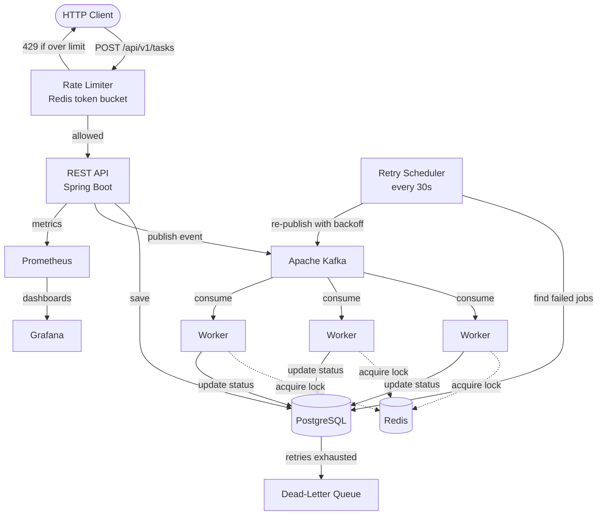

<div align="center">

# Distributed Task Scheduler

### Schedule background jobs over an API, run them reliably across multiple workers, and watch the whole system in real time

[](https://openjdk.org/projects/jdk/21/)
[](https://spring.io/projects/spring-boot)
[](https://kafka.apache.org/)
[](https://redis.io/)
[](https://www.postgresql.org/)
[](https://prometheus.io/)
[](https://grafana.com/)
[](https://www.docker.com/)

[](https://github.com/PubuduGunasekara/distributed-task-scheduler/actions)
[](LICENSE)

</div>

---

<!--
## Demo

ADD YOUR DEMO HERE.
Easiest way to host a video on GitHub:
1. Record a 60-90s screen capture (.mp4).
2. Open a new GitHub Issue in this repo and drag the .mp4 into the comment box.
3. GitHub uploads it and gives you a URL. Copy that URL and paste it below, then close the issue (the video stays hosted).
For images: save them in docs/screenshots/ and uncomment the table below.

| Creating a task | Live Grafana dashboard |
|:---:|:---:|
|  |  |
-->

## What is this, in plain English?

Imagine your app needs to do work that shouldn't happen while a user waits, like sending 10,000 emails, generating a report, or processing an upload. You don't want your web server stuck doing that. Instead, you hand the job to a task scheduler: it accepts the job, stores it safely, and lets background workers pick it up and run it.

This project is that system, built the way real production services such as AWS SQS or Google Cloud Tasks work. "Distributed" means the work is spread across several workers running at the same time, so it scales out — and if one worker crashes mid-job, a background recovery process notices and hands the job to another worker instead of leaving it stuck forever.

---

## Why it's interesting

Running background jobs *reliably* is harder than it looks. Here are the real problems this system handles, in plain terms:

- **Never run the same job twice, three different ways.** Kafka guarantees at-least-once delivery, so duplicate or redelivered events are expected, not edge cases. A Redis lock lets only one worker touch a job at a time, released with a small Lua script so a worker can never accidentally release another worker's lock. Underneath that, a database state machine only lets a job start once. And underneath that, optimistic locking makes two simultaneous writes to the same job fail safely instead of silently overwriting each other. No single layer is trusted alone.
- **Don't give up on failures, but don't hammer them either.** A failed job is retried with exponential backoff — 10s, then 30s, then 90s — giving transient problems (a network blip, a downstream restart) time to clear instead of retrying instantly forever. That's an initial attempt plus three retries; the fourth failure marks the job `DEAD_LETTER` in the database and publishes it to a dedicated `task-dlq` Kafka topic for manual inspection, instead of dropping it silently.
- **Recover automatically when a worker crashes.** If a worker dies mid-job, the job would otherwise sit stuck forever — its Redis lock eventually expires, but nothing else notices on its own. A background scheduler polls for jobs stuck running past a timeout and fails them through the same retry path as any other failure, and separately re-publishes jobs whose creation event appears to have been lost. Multiple app instances can run this at once safely; a lost race is just a database exception that gets logged and skipped.
- **See what's happening.** Every component reports metrics to Prometheus, which are visualized in Grafana dashboards.
- **Keep the code clean.** The business logic is isolated from the infrastructure with a ports-and-adapters (hexagonal) architecture, and a build-time ArchUnit test fails the build if that boundary is ever broken.
- **Prove it with tests, not just claims.** 165 tests — unit tests plus real-Postgres and real-Redis integration tests via Testcontainers — with CI enforcing an 80% line and 80% branch coverage gate. The current run sits at 94.6% line / 90.0% branch.

---

## Architecture



The flow, step by step: a request comes in, the rate limiter checks it, the task is saved to PostgreSQL and an event is published to Kafka. A free worker consumes the event, grabs a Redis lock, runs the task, and updates its status. If it failed, the retry scheduler re-publishes it with backoff. If it keeps failing, it lands in the dead-letter queue. Prometheus and Grafana watch the whole thing.

This runs as a single Spring Boot service, not a microservices system — a modular monolith internally organized with hexagonal architecture (ports and adapters). Worker throughput scales horizontally by running more instances of that same service: they join the same Kafka consumer group and split partitions automatically, so there's no separate "worker" service to deploy.

---

## Tech Stack

| Layer | Technology | Why |
|---|---|---|
| Language | Java 21 | Virtual threads, records, pattern matching |
| Framework | Spring Boot 3.5 | REST API, dependency injection, scheduling |
| Messaging | Apache Kafka 3.7 (KRaft) | Decouples the API from the workers |
| Database | PostgreSQL 16 (Flyway) | Source of truth for task state |
| Cache and locks | Redis 7.2 | Distributed locking and rate limiting |
| Observability | Micrometer, Prometheus, Grafana | Metrics and dashboards |
| Quality | Maven, JaCoCo (80% gate), ArchUnit | Tests and enforced architecture |
| Packaging | Docker (multi-stage), GitHub Actions | Build, test, containerize |

---

## Getting Started

### Prerequisites
- Docker and Docker Compose (for Postgres, Redis, Kafka, Prometheus, Grafana)
- Java 21 (the project ships with `./mvnw`, so a separate Maven install isn't required)

### 1. Start the infrastructure
```bash
make infra-up        # starts Postgres, Redis, Kafka, Prometheus, Grafana
```

### 2. Run the application
```bash
./mvnw spring-boot:run
```
The API starts on http://localhost:8080

### 3. Open the dashboards

| Service | URL |
|---|---|
| API status | http://localhost:8080/api/v1/status |
| Prometheus | http://localhost:9090 |
| Grafana | http://localhost:3000 |

### Useful commands
```bash
make build       # compile and package
make test        # run the test suite
make infra-logs  # tail the infrastructure logs
make infra-down  # stop the infrastructure
make infra-clean # stop and remove all data volumes
```

---

## API Reference

Base path: `/api/v1`

| Method | Endpoint | What it does |
|---|---|---|
| `POST` | `/tasks` | Create and schedule a new task |
| `GET` | `/tasks/{id}` | Get a single task by its ID |
| `GET` | `/tasks/due` | List tasks that are due to run |
| `PATCH` | `/tasks/{id}/cancel` | Cancel a pending task |
| `GET` | `/status` | System health and status |

Example, creating a task:
```bash
curl -X POST http://localhost:8080/api/v1/tasks \
  -H "Content-Type: application/json" \
  -d '{
    "name": "send-welcome-email",
    "type": "SEND_EMAIL",
    "payload": "{\"to\":\"user@example.com\"}",
    "priority": 5,
    "scheduledAt": "2027-01-01T10:00:00Z"
  }'
```

---

## Project Structure

```
src/main/java/com/taskscheduler/
├── domain/          # Entities, services, ports (interfaces), and domain events. No framework code.
├── worker/          # Kafka consumer, task executors, distributed locking, retry, and crash recovery
├── infrastructure/  # Adapters: Redis lock/rate limiter, Kafka publisher, metrics (the "how")
├── api/             # REST controllers, DTOs, and exception handling (the entry point)
└── config/          # Spring wiring and externalized configuration
```

The `domain` layer depends on nothing external. That boundary is checked automatically by an ArchUnit test, so the architecture can't quietly rot over time.

---

## Known Limitations and Next Steps

- **Fixed lock TTL, no lease renewal or fencing tokens** — a job whose real runtime exceeds the recovery scheduler's execution timeout (default 5 minutes) can be marked failed while the original worker is still legitimately running it. The state machine prevents any corruption, but the worker's real outcome is silently discarded rather than surfaced. Set the timeout well above the slowest expected job type.
- **At-least-once delivery end to end** (Kafka redelivery, orphan re-publishing, retry re-queuing) — job executors with external side effects must be idempotent; the scheduler doesn't deduplicate at the business-logic level.
- **Retries and recovery are both polling-based** — actual retry delay is backoff plus up to one 30-second poll interval, and a stuck job can sit for up to one recovery-scheduler poll interval (default 60s) past its timeout before being noticed.
- **No leader election for the recovery scheduler** — every app instance runs it independently, which is safe (optimistic locking and the state machine are the real guards, not scheduling) but means redundant recovery attempts under multiple instances.
- **A single poll cycle caps how many stale jobs it processes** (100 by default) — a larger backlog clears over several cycles, not immediately.

---

## What I Learned

This project was a hands-on study of the patterns behind real distributed systems: at-least-once delivery and idempotency, safe distributed locking, retry and backoff strategies, dead-letter handling, and production-grade observability, while keeping all of it testable through a clean architecture.

---

## Author

**Pubudu Gunasekara**
M.S. Computer Science, Northeastern University (Silicon Valley)
Backend and distributed systems. Open to a software engineering co-op (Jan to Aug 2027).

[](https://pubudugunasekara.github.io/)
[](https://www.linkedin.com/in/pubudugunasekera/)
[](https://github.com/PubuduGunasekara)

---

<div align="center">

**Thanks for checking out this project.**
If you found it useful or interesting, consider leaving a star, and feel free to reach out about backend, distributed systems, or co-op opportunities.

Built by Pubudu Gunasekara · MIT License

</div>
