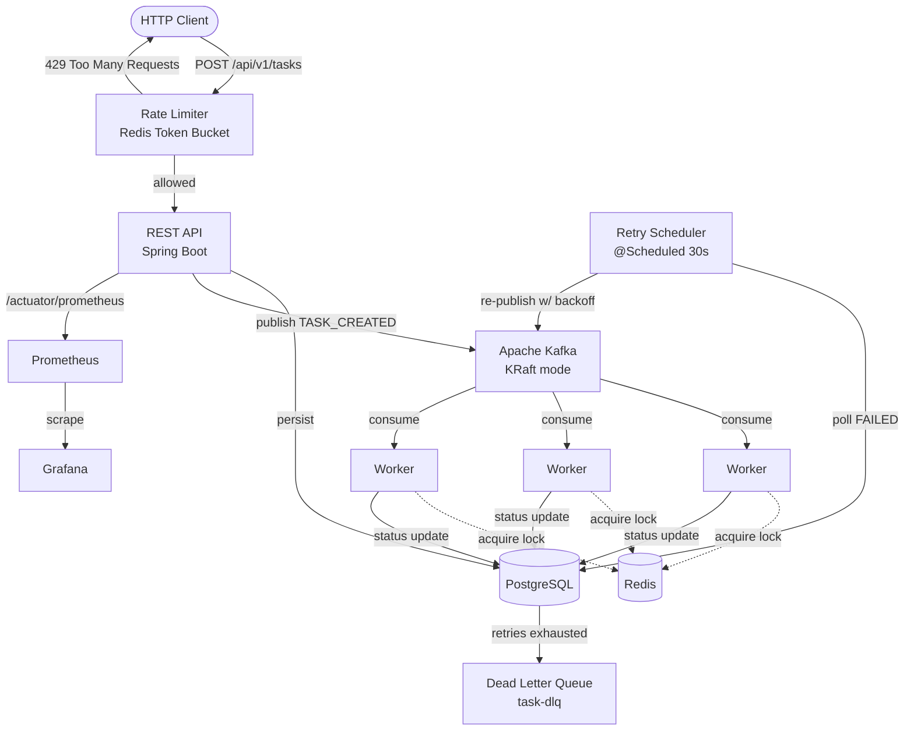

# Distributed Task Scheduler

A production-grade distributed task scheduler built with Java 21 and Spring Boot 3.5, demonstrating real-world backend engineering patterns: asynchronous processing via Kafka, distributed locking via Redis, exponential-backoff retries with dead-letter routing, token-bucket rate limiting, and full Prometheus/Grafana observability.

Built as a hands-on study of the patterns that power systems like AWS SQS, Google Cloud Tasks, and Celery.

[](https://github.com/PubuduGunasekara/distributed-task-scheduler/actions)

---

## Architecture



A task flows: **API → PostgreSQL → Kafka → Worker → Redis lock → execute → status update**. Failed tasks are retried with exponential backoff (10s / 30s / 90s) and routed to a dead-letter queue after exhausting retries.

---

## Tech Stack

| Layer | Technology |
|---|---|
| Language | Java 21 (virtual threads, records, pattern matching) |
| Framework | Spring Boot 3.5 |
| Messaging | Apache Kafka 3.7 (KRaft mode — no ZooKeeper) |
| Database | PostgreSQL 16 (Flyway migrations) |
| Cache / Locks | Redis 7.2 (Lua scripting for atomicity) |
| Observability | Micrometer → Prometheus → Grafana |
| Build | Maven, JaCoCo (80% coverage gate), ArchUnit |
| CI/CD | GitHub Actions → GitHub Container Registry |
| Containerization | Docker (multi-stage, multi-arch amd64/arm64) |

---

## Key Design Decisions

**Hexagonal architecture** — Domain logic depends on ports (interfaces), never on infrastructure. `RateLimiterPort`, `DistributedLockPort`, and `TaskEventPort` keep the domain testable in isolation. Enforced automatically by ArchUnit tests.

**Distributed locking** — Workers acquire a Redis lock (`SETNX` + TTL) before processing a task, so the same task is never executed twice even with multiple worker instances consuming the same Kafka partition. Lock release uses a Lua compare-and-delete script to prevent releasing another worker's lock.

**Exponential backoff retry** — A `@Scheduled` poller finds `FAILED` tasks and re-queues them only after their backoff window elapses (10s → 30s → 90s). After 3 attempts, tasks route to a dead-letter topic for manual inspection.

**Token bucket rate limiting** — An atomic Redis Lua script enforces per-client request limits. The entire check-and-decrement runs server-side — two concurrent requests can never both consume the last token.

**Observability first** — Every state transition emits a Micrometer metric. Execution latency is captured as a histogram, enabling accurate p50/p95/p99 via Prometheus `histogram_quantile()`.

---

## Performance

Measured locally (Apple Silicon, single instance):

| Metric | Value |
|---|---|
| Task execution (p50) | ~58ms |
| Kafka round-trip (create → worker pickup) | ~412ms |
| Lock acquisition success rate | 100% (zero contention at test load) |

---

## Getting Started

### Prerequisites
- Java 21
- Docker & Docker Compose

### Run locally

```bash
# Start infrastructure (PostgreSQL, Redis, Kafka, Prometheus, Grafana)
docker compose up -d

# Run the application
./mvnw spring-boot:run
```

The API is available at `http://localhost:8080`, Grafana at `http://localhost:3000`, Prometheus at `http://localhost:9090`.

### Create a task

```bash
curl -X POST http://localhost:8080/api/v1/tasks \
  -H "Content-Type: application/json" \
  -d '{
    "name": "send-welcome-email",
    "type": "EMAIL_SEND",
    "payload": "{\"to\":\"user@example.com\"}",
    "priority": 5,
    "scheduledAt": "2026-06-01T10:00:00Z"
  }'
```

---

## API Reference

| Method | Endpoint | Description |
|---|---|---|
| POST | `/api/v1/tasks` | Submit a new task (rate-limited) |
| GET | `/api/v1/tasks/{id}` | Retrieve task by ID |
| GET | `/api/v1/tasks/due` | List tasks due for execution |
| PATCH | `/api/v1/tasks/{id}/cancel` | Cancel a pending task |
| GET | `/actuator/health` | Health check |
| GET | `/actuator/prometheus` | Prometheus metrics |

Errors follow RFC 7807 (`application/problem+json`). Rate-limited responses include `X-RateLimit-Limit`, `X-RateLimit-Remaining`, and `Retry-After` headers.

---

## Testing

```bash
./mvnw verify    # runs all tests + enforces 80% coverage
```

The suite includes unit tests (JUnit 5 + Mockito), repository integration tests (Testcontainers PostgreSQL), distributed lock integration tests (Testcontainers Redis), web-layer slice tests (`@WebMvcTest`), and architecture conformance tests (ArchUnit).

---

## CI/CD

Every push and pull request runs a two-stage GitHub Actions pipeline:

1. **Build & Test** — compiles, runs the full test suite, enforces the 80% JaCoCo coverage gate
2. **Docker Build & Push** — builds a multi-arch (amd64/arm64) image and pushes to GitHub Container Registry on merge to `main`

Branch protection requires the pipeline to pass before any merge to `main`.

---

## Project Structure

```
src/main/java/com/taskscheduler/
├── api/            REST controllers, DTOs, interceptors, exception handling
├── domain/         Entities, services, ports, domain events
├── worker/         Kafka consumers, executors, distributed locking, retry
├── infrastructure/ Kafka publishers, Redis adapters, metrics
└── config/         Spring configuration, properties
```

---

## Production Deployment

The application runs with the `prod` profile, which reads all configuration from environment variables (see `.env.example`). No secrets are stored in the repository. Graceful shutdown ensures in-flight requests and tasks complete cleanly on `SIGTERM`.

```bash
docker run -d \
  -e SPRING_PROFILES_ACTIVE=prod \
  -e DB_HOST=... -e DB_PASSWORD=... \
  -e REDIS_HOST=... -e KAFKA_BOOTSTRAP_SERVERS=... \
  ghcr.io/pubudugunasekara/distributed-task-scheduler:latest
```